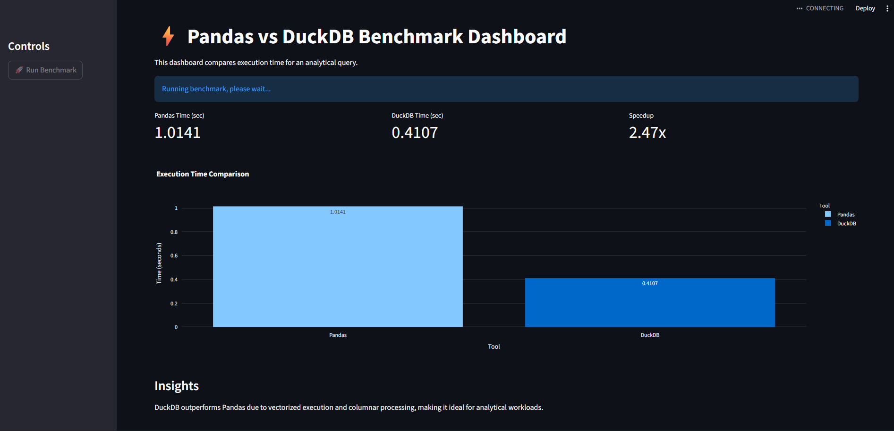

# Benchmarking Pandas vs DuckDB Using an Interactive Dashboard

## Introduction

Pandas is one of the most commonly used tools for data analysis in Python.
Recently, analytical databases like DuckDB have gained attention for their
performance advantages, especially on large datasets.

In this project, I perform a practical benchmark comparing Pandas and DuckDB
on an analytical aggregation query and present the results using an
interactive Streamlit dashboard.

---

## Problem Statement

The goal of this benchmark is to answer a simple question:

**How does Pandas compare with DuckDB when executing an analytical aggregation
query on a large CSV dataset?**

Rather than relying on assumptions or blog claims, this project focuses on
measuring actual execution time under identical conditions.

---

## Dataset Description

- Size: 1,000,000 rows
- Format: CSV
- Columns:
  - user_id
  - age
  - country
  - salary
  - purchase_amount

The dataset was synthetically generated using Python to ensure
reproducibility and consistency across benchmark runs.

---

## Benchmark Methodology

To ensure a fair comparison:

- The same dataset was used for both Pandas and DuckDB
- The same analytical query was executed in both cases
- Execution time was measured using Python’s time module
- All experiments were run locally on the same machine

The benchmark query computes the average salary grouped by country.

---

## Interactive Dashboard

To make the benchmark more intuitive, an interactive dashboard was built
using Streamlit.

The dashboard allows the user to:
- Trigger the benchmark with a button click
- View execution time for Pandas and DuckDB
- Observe the performance difference using Plotly charts
- Understand the performance gap through computed speedup metrics

This approach improves transparency and makes the experiment easy to
reproduce.

---

## Dashboard Preview and Code Access

Below is a preview of the interactive Streamlit dashboard generated as part
of this project.

The complete source code, dataset generation script, and instructions to
reproduce this benchmark are available in the GitHub repository:

🔗 **GitHub Repository:**  
https://github.com/your-username/duckdb-benchmark-dashboard

---

## Benchmark Results [Code Access](app.py)

The benchmark was executed on a synthetically generated CSV dataset
containing **1 million rows**.

The following execution times were observed for the aggregation query
that computes the average salary grouped by country:

| Tool    | Execution Time (seconds) |
|---------|--------------------------|
| Pandas  | ~1.01                    |
| DuckDB  | ~0.41                    |

On this workload, DuckDB completed the query approximately
**2.4× faster** than Pandas.

The exact execution time may vary slightly depending on system
configuration, but the relative performance trend remains consistent.

---

## Results and Insights

In repeated runs, DuckDB consistently executed the aggregation query
faster than Pandas.

This performance advantage can be attributed to:
- Vectorized execution in DuckDB
- Columnar data processing
- Efficient query execution on CSV files without fully loading data
  into memory

Pandas, while flexible and easy to use, incurs additional overhead due to
row-based operations and in-memory DataFrame processing.

---

## Conclusion

This benchmark demonstrates that DuckDB can offer meaningful performance
benefits for analytical workloads on large CSV datasets.

Pandas remains an excellent tool for data manipulation and exploration,
while DuckDB serves as a powerful complement for fast analytical queries.
Choosing the right tool depends on the workload and performance requirements.

---

## Reproducibility

All code, dataset generation scripts, and instructions are included in the
accompanying GitHub repository, allowing anyone to reproduce the benchmark.

